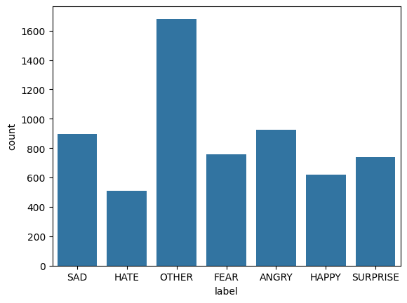
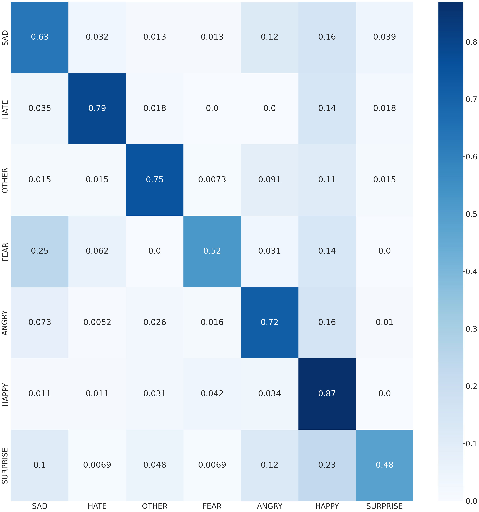

# Sentiment-analysis-in-Persian-text-using-deep-learning
We have developed a text classification model for Persian language using the [ArmanEmo dataset](https://github.com/Arman-Rayan-Sharif/arman-text-emotion?tab=readme-ov-file) and the Hugging Face model.

## Table of Contents

1. [Dataset](#dataset)
2. [Model](#model)
3. [Results](#results)
4. [How to run](#how-to-run)
5. [References](#references)

## Dataset
The ArmanEmo dataset has been collected from various sources, including Persian tweets from Twitter, users' comments on Instagram, and customers' comments on Digikala (an online shopping platform). These sources were chosen to capture a diverse range of textual data that reflects individuals' emotions and opinions on social and political topics. The dataset aims to be representative and encompass different online platforms commonly used in Iran, where individuals express their ideas and emotions.

The ArmanEmo dataset consists of seven classes with the following distribution:

## Model
We utilized the powerful Hugging Face platform, which provides access to a wide range of powerful models. We leveraged libraries within this platform, such as tokenization and more. We experimented with various models, including ParsBert, ALBERT, roberta_facebook, and roberta-base-ft-udpos28, in order to achieve the desired performance. Ultimately, we achieved the highest accuracy on the test data using the persian_xlm_roberta_large model.

We went through the following four steps:

1. Preprocessed the train and test datasets.
2. Tested different models and selected the best model.
3. Saved the best model.
4. Evaluated the performance using metrics such as F1 score, precision, recall, and accuracy.

## Results
The evaluation results on the test data were as follows:
Precision: 0.732781028240936
Recall: 0.7115551694178974
F1 score: 0.7094612321075684

And the confusion matrix was as follows:

You can refer to the accompanying PDF document for detailed implementation steps. Please see the [PDF file](IntroDL_Project_SadeghPoulaei_FatemehAskari.pdf) for a comprehensive guide on how to execute the code.

## How to run
1. Download the ArmanEmo dataset using the provided link.
2. Run the notebook in the "preprocess" folder [[Notebook]](preprocess/DL_Project_PreProcess.ipynb).
3. Run the notebook in the "main_model" folder [[Notebook]](main_model/DL_Project_Model_XML_Roberta_MAINN_Result.ipynb).
4. You can also apply the text classification results on your own dataset by running the notebook in the "predict_evaluate" folder. Simply perform the second step, which is preprocessing, on your dataset, and then use the saved best model in the "save_best_model" folder to classify your text dataset [[Notebook]](predict_evaluate/Predicted_Evaluate.ipynb).

## References

https://huggingface.co/docs/transformers/en/tasks/sequence_classification

https://arxiv.org/pdf/2207.11808.pdf

